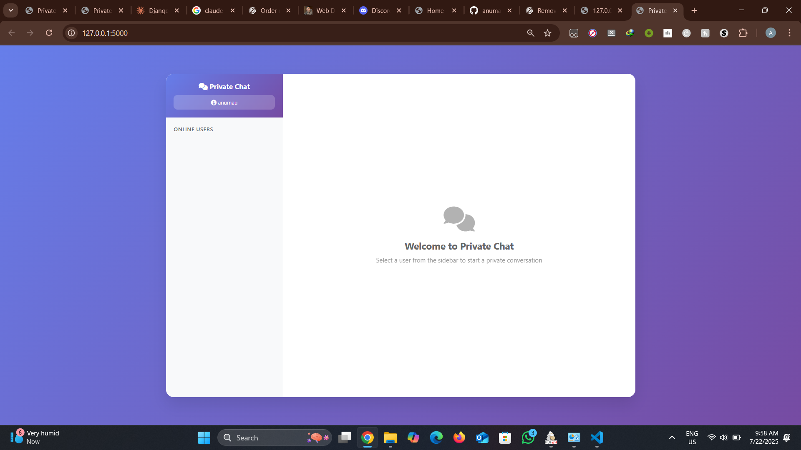
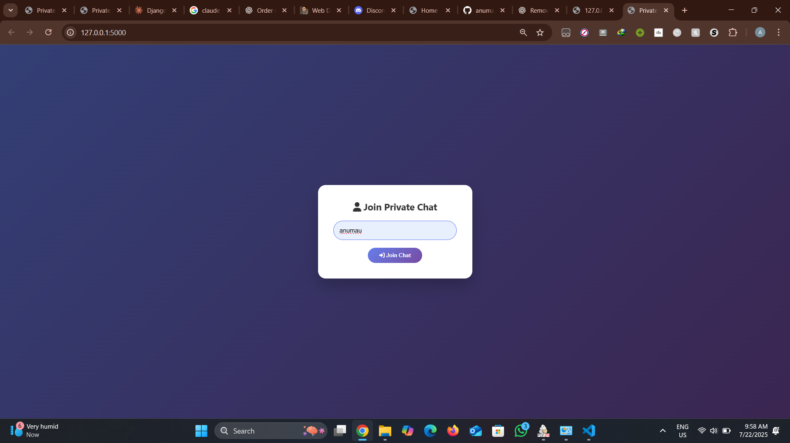
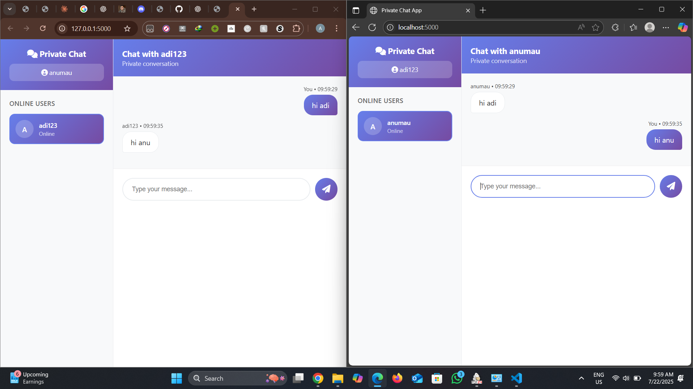

# Flask Private Chat Application - Modular Architecture

A real-time private chat application built with Flask and Socket.IO featuring a modern, responsive GUI with user-based separate conversations. This version uses a **modular architecture** for better maintainability and scalability.

## 📸 **Preview Screenshots**

### 🎨 **Main Chat Interface**

*Modern sidebar design with user list and private chat conversations*

### 👤 **Username Login**

*Clean username entry modal with gradient background*

### 💬 **Private Conversation**

*Real-time private messaging with message bubbles and timestamps*

> **Note**: To add actual screenshots, create a `screenshots/` folder in your project and add the PNG files mentioned above. You can take screenshots while the app is running and save them with these exact names.

## 🏗️ **Modular Architecture**

The application is now organized using a clean, modular structure:

```
flask-private-chat/
├── run.py                    # Main entry point (NEW)
├── app.py                    # Legacy entry point (backward compatibility)
├── requirements.txt          # Python dependencies
├── config/                   # Configuration management
│   ├── __init__.py
│   └── config.py            # Environment-based configuration
├── app/                      # Main application package
│   ├── __init__.py          # Application factory
│   ├── models/              # Data models
│   │   ├── __init__.py
│   │   └── chat_models.py   # User, Message, ChatRoom models
│   ├── services/            # Business logic
│   │   ├── __init__.py
│   │   └── chat_service.py  # ChatManager service
│   ├── routes/              # HTTP routes
│   │   ├── __init__.py
│   │   └── main_routes.py   # Web routes and API endpoints
│   ├── events/              # Socket.IO event handlers
│   │   ├── __init__.py
│   │   └── chat_events.py   # Real-time event handling
│   └── templates/           # HTML templates
│       └── index.html       # Modern chat interface
└── README.md               # This file
```

## ✨ **Features**

### 🔐 **Private Messaging System**
- **One-on-one conversations**: Each user pair gets their own isolated chat room
- **Message privacy**: Only the two participants can see their conversation
- **Real-time delivery**: Messages appear instantly using WebSockets

### 👥 **User Management**
- **Live user list**: See who's online in real-time
- **User avatars**: Automatic avatar generation with user initials
- **Session handling**: Secure user session management

### 🎨 **Modern Interface Design**
- **Sidebar navigation**: WhatsApp-style user selection interface
- **Message bubbles**: Distinct styling for sent vs received messages
- **Responsive layout**: Perfect on desktop, tablet, and mobile devices
- **Beautiful gradients**: Professional purple-blue gradient theme

### ⚡ **Real-time Features**
- **Instant messaging**: Socket.IO powered real-time communication
- **Live user updates**: User list updates when people join/leave
- **Connection status**: Visual indicators for online users
- **Message history**: Persistent chat history per conversation

### 🏗️ **Technical Excellence**
- **Modular architecture**: Clean separation of concerns
- **Configuration management**: Environment-based settings
- **Error handling**: Comprehensive validation and error management
- **Security**: XSS protection and input sanitization

## 📦 **Installation**

1. **Install Python 3.7 or higher**
2. **Install required packages:**
   ```bash
   pip install -r requirements.txt
   ```

## 🚀 **Running the Application**

### **Method 1: Using the new modular entry point (Recommended)**
```bash
cd "c:\Users\PC\Desktop\New folder"
python run.py
```

### **Method 2: Using the legacy entry point (Backward compatibility)**
```bash
cd "c:\Users\PC\Desktop\New folder"
python app.py
```

### **Method 3: Using virtual environment**
```bash
cd "c:\Users\PC\Desktop\New folder"
.venv\Scripts\activate
python run.py
```

### **Method 4: With environment configuration**
```bash
# Development mode (default)
set FLASK_CONFIG=development
python run.py

# Production mode
set FLASK_CONFIG=production
python run.py
```

3. **Open your web browser and go to:** `http://localhost:5000`

## 🎯 **Usage**

1. **Join the chat**: Enter your username when prompted
2. **Select a user**: Click on any user from the sidebar to start a private conversation
3. **Send messages**: Type your message and press Enter or click the send button
4. **Switch conversations**: Click on different users to switch between private chats
5. **Real-time messaging**: Messages appear instantly for both users

## 🖥️ **Interface Overview**

- **Left Sidebar**: Shows your username and list of online users
- **Main Chat Area**: Displays the selected private conversation
- **Welcome Screen**: Shows when no conversation is selected
- **Message Bubbles**: Your messages (blue) vs others (white)
- **User Avatars**: Show the first letter of each username

## 🔧 **Modular Components**

### **Configuration (`config/`)**
- Environment-based configuration management
- Support for development, production, and testing environments
- Centralized settings for security and deployment

### **Models (`app/models/`)**
- **User**: Manages user data and room memberships
- **Message**: Handles message structure and formatting
- **ChatRoom**: Manages private conversations between users

### **Services (`app/services/`)**
- **ChatManager**: Core business logic for chat operations
- User management, room creation, message handling
- Centralized state management

### **Routes (`app/routes/`)**
- HTTP endpoint definitions
- API routes for user management
- Health check endpoints

### **Events (`app/events/`)**
- Socket.IO event handlers
- Real-time communication logic
- Connection and message management

## 🛠️ **Technologies Used**

- **Backend**: Flask, Flask-SocketIO (with rooms for private chats)
- **Frontend**: HTML5, CSS3, JavaScript
- **Real-time Communication**: Socket.IO with room-based messaging
- **Architecture**: Modular design with separation of concerns
- **Configuration**: Environment-based configuration management
- **Styling**: Custom CSS with gradients, animations, and responsive design
- **Icons**: Font Awesome

## 🔄 **How Private Chat Works**

1. **User Connection**: Each user gets a unique session ID when connected
2. **Room Creation**: Private rooms are created using a consistent naming pattern for two users
3. **Message Isolation**: Messages are only sent to users in the specific room
4. **User Management**: Real-time tracking of online users and their active conversations
5. **Message History**: Each private conversation maintains its own message history

## 🎨 **Key Improvements in Modular Version**

- **Separation of Concerns**: Clear separation between models, services, routes, and events
- **Maintainability**: Easier to modify and extend individual components
- **Testability**: Each module can be tested independently
- **Scalability**: Better structure for adding new features
- **Configuration Management**: Environment-based settings
- **Error Handling**: Improved error handling and validation
- **Code Reusability**: Modular components can be reused
- **Development Experience**: Better organization for team development

## 📱 **Visual Feature Gallery**

### 🎯 **Core Features Showcase**

| Feature | Screenshot | Description |
|---------|------------|-------------|
| **🔐 Private Messaging** |  | Secure one-on-one conversations with message history |
| **👥 User Management** |  | Real-time online user list with avatars |
| **📱 Mobile Ready** |  | Fully responsive design for all devices |
| **⚡ Real-time Updates** |  | Instant message delivery and user status updates |
| **🎨 Modern UI** |  | Beautiful gradients and professional design |

### 🏆 **Why Choose This Chat App?**

✅ **Professional Grade**: Production-ready modular architecture  
✅ **Beautiful Design**: Modern UI with smooth animations  
✅ **Real-time Performance**: Instant messaging with Socket.IO  
✅ **Mobile First**: Responsive design for all screen sizes  
✅ **Privacy Focused**: Isolated private conversations  
✅ **Developer Friendly**: Well-documented modular codebase  
✅ **Easy to Deploy**: Simple setup with virtual environment  
✅ **Extensible**: Easy to add new features and customize  

---

### 🤝 **Contributing**

Want to contribute? Check out our [Development Guide](./DEVELOPMENT.md) for detailed information about the modular architecture and how to extend the application.

### 📞 **Support**

If you encounter any issues or have questions:
1. Check the [Development Guide](./DEVELOPMENT.md)
2. Run the verification script: `python test_modules.py`
3. Review the logs for error messages
4. Open an issue on GitHub

**Built with ❤️ using Flask, Socket.IO, and modern web technologies.**
